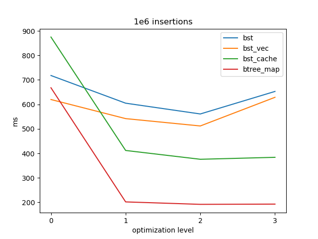

This is a superficial experiment with a binary search tree implementation. The idea is to group 32-bit key entries into "packets" of 7, fitting neatly into 64 bytes — typically the size of a CPU cache line.

Another goal is to take my first steps in Rust.

Bench sample:

